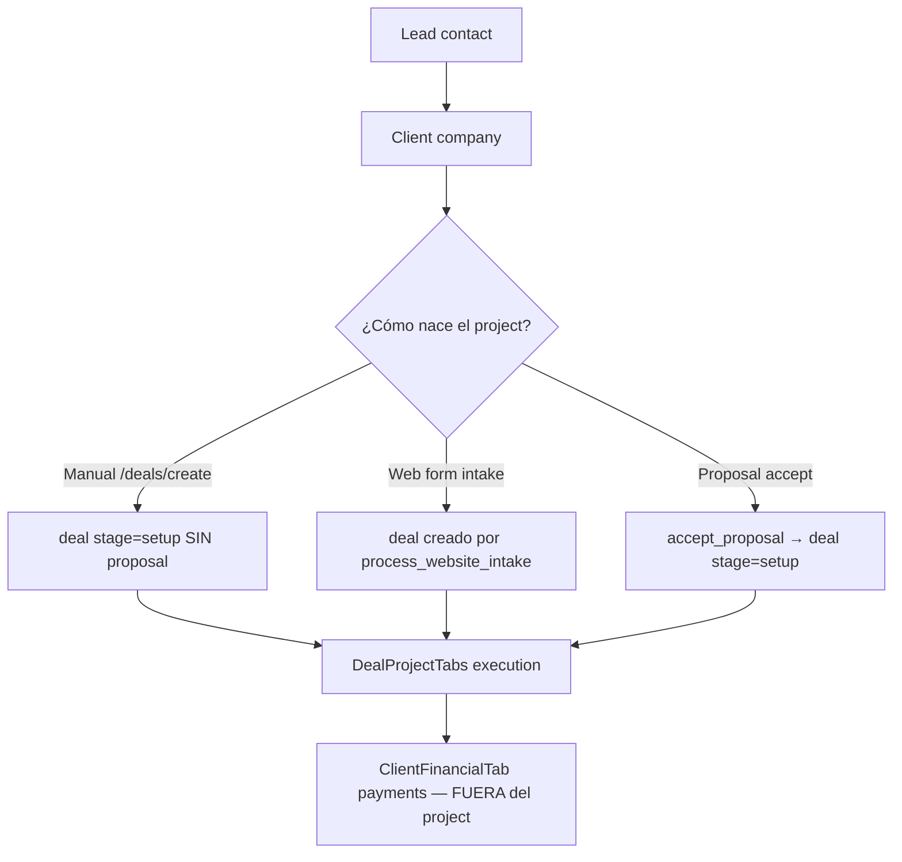

# Nomi CRM — Auditoría Profunda del Módulo Projects (LBS)

> **Fecha:** 2026-05-22  
> **Alcance:** módulo Projects en modo LBS (`VITE_PRODUCT_MODE=lbs`)  
> **Regla:** solo diagnóstico. Sin cambios de código.  
> **Relacionado:** `SYSTEM_AUDIT_V2.md`, `MESSAGES_AUDIT.md`, `RBAC_DESIGN.md`

---

## A. Resumen del estado actual

**Veredicto:** El módulo "Projects" **existe funcionalmente pero no existe como entidad**. Es un **alias de producto sobre `deals`**, con una capa LBS bien intencionada (brief, resources, team chat) embebida en un monolito (`DealShow.tsx`, 5,278 LOC). Para administrar proyectos web/marketing **sirve como MVP operativo**, pero **está mal modelado comercialmente**: se pueden crear "proyectos" sin propuesta aceptada, los estados son demasiado gruesos para diseño/desarrollo, y finanzas/mensajes cliente están **fragmentados** fuera del detalle del proyecto.

**Lo que funciona:**
- Pipeline Kanban post-venta (5 stages)
- `accept_proposal` → crea deal en `setup` (flujo correcto cuando se usa)
- Website brief JSONB rico y adaptativo por `project_type`
- Resources con categorías + formulario público cliente
- Tasks + calendar vinculados a `deal_id`
- Team chat interno por proyecto

**Lo que está mal planteado:**
- **Deal = Project = misma fila** — no hay separación oportunidad vs ejecución
- Creación manual y web form **saltan** el paso Proposal → Accept
- 5 stages no reflejan realidad web (design, dev, waiting on client)
- Tab Payments/Invoices **no existe** en project detail (vive en Client profile)
- Messages tab = solo team chat; SMS cliente está en header, no en tab unificada
- `attachments` bucket **público** — riesgo para logos/fotos cliente
- ~3,500 LOC de tabs contractor en `DealShow` **muertas** en build LBS

**Recomendación estratégica:** **Opción C** — mantener `deals` como storage pero introducir semántica clara `lifecycle_phase` (sales vs delivery) + descomponer UI; **no** crear tabla `projects` separada todavía.

---

## B. Archivos exactos relacionados

### Core deals (atomic-crm)

```
src/components/atomic-crm/deals/
├── DealShow.tsx              # 5278 LOC — monolito; LBS branch ~200 LOC + DealProjectTabs
├── DealList.tsx              # Kanban + table + routes /deals/*
├── DealCreate.tsx            # Create manual
├── DealEdit.tsx
├── DealInputs.tsx / LbsDealInputs (import)
├── DealCard.tsx, DealColumn.tsx, DealListContent.tsx, DealTableView.tsx
├── DealArchivedList.tsx, DealEmpty.tsx
├── DealsExplorerPanel.tsx
├── ProjectStageFlow.tsx      # Stage picker en show
├── pipelines.ts, stages.ts, deal.ts, dealUtils.ts
├── projectForm.ts, projectAssignments.ts
└── index.ts                  # Resource registry
```

### LBS project layer (45 archivos)

```
src/lbs/deals/
├── DealProjectTabs.tsx       # Tab shell LBS (7 tabs)
├── LbsProjectOverviewTab.tsx
├── LbsDealHeaderOverview.tsx
├── WebsiteBriefTab.tsx, WebsiteBriefFormSections.tsx
├── WebsiteBriefSectionSheet.tsx, WebsiteBriefSectionView.tsx
├── websiteBriefSchema.ts     # ~560 LOC — secciones brief
├── projectBriefProgress.ts, BriefProgressBar.tsx
├── ProjectResourcesTab.tsx, ResourceCategorySection.tsx
├── ResourceUploadDialog.tsx, ResourceLightbox.tsx
├── projectResourceConstants.ts, projectResourceUpload.ts
├── projectResourceGrouping.ts, ProjectResourceLinkedDocs.tsx
├── SendProjectResourcesDialog.tsx, SendProjectWebFormDialog.tsx
├── ProjectSecurityTab.tsx, projectAccessConstants.ts
├── ProjectCreateFlow.tsx, NewProjectChooserDialog.tsx
├── ProjectScopeChecklist.tsx, dealStageTaskTemplates.ts
├── lbsProjectConstants.ts    # Stages, project types
├── dealProjectTabUtils.ts    # Tab slugs + legacy map
├── projectTabProgress.ts, projectDeliveryDate.ts
├── LbsProjectDeliveryUrgency.tsx, ProjectDeliveryCountdownText.tsx
├── ProjectGithubLink.tsx, githubRepo.ts, useGithubRepoStatus.ts
├── ProjectTaskStats.tsx, ProjectAssignedAvatars.tsx
├── LbsProjectClientFields.tsx, websiteIntakeForm.ts
└── supabaseSchemaErrors.ts
```

### Integraciones

```
src/lbs/calendar/ProjectCalendarEventsList.tsx, CalendarProjectFilter.tsx
src/lbs/messages/ProjectTeamChat.tsx, useEnsureProjectConversation.ts
src/lbs/messages/DealClientSmsButton.tsx (en DealShow header)
src/lbs/proposals/ProposalShow.tsx — accept → navigate to deal
src/lbs/clients/ClientFinancialTab.tsx — payments fuera del project
src/lbs/web-forms/PublicProjectResourcesForm.tsx
src/lbs/tickets/CreateTicketButton.tsx (en DealProjectTabs)
```

### Backend

```
supabase/migrations/
├── 20260310113000_projects_module_foundation.sql
├── 20260311190000_project_details_operational_tabs.sql
├── 20260521120000_lbs_crm_modules.sql
├── 20260521180000_deal_resources.sql
├── 20260521190000_deal_access_entries.sql
├── 20260521240000_lbs_five_stage_pipeline.sql
├── 20260629170000_calendar_events.sql
├── 20260629200000_project_resources_form.sql

supabase/functions/
├── accept_proposal/index.ts
├── submit_project_resources/index.ts
├── process_website_intake/index.ts
├── get_public_deal_brief/index.ts
```

### Routing

```
src/components/atomic-crm/root/CRM.tsx     — Resource deals, /projects → /deals redirect
src/lbs/navigation.ts                      — Sidebar "Projects" → /deals
src/lbs/LbsCustomRoutes.tsx                — NO deal routes (usa RA resource)
```

---

## C. Tablas relacionadas

| Tabla | FK | Rol en Projects |
|-------|-----|-----------------|
| **`deals`** | — | **Entidad Project** (LBS) |
| `deals.website_brief` | jsonb | Brief completo |
| `deals.project_type`, `category` | text | Tipo servicio |
| `deals.stage` | text | Pipeline post-venta |
| `deals.amount`, `estimated_value`, `current_project_value` | numeric | Finanzas (duplicadas) |
| `deals.github_repo` | text | Dev delivery |
| `deals.start_date`, `expected_end_date`, `actual_completion_date` | date | Schedule |
| `proposals` | `deal_id` nullable | Cotización; set on accept |
| `proposal_line_items` | `proposal_id` | Scope comercial |
| `contracts` | `deal_id`, `proposal_id` | Legal post-venta |
| `deal_resources` | `deal_id` | Files/images |
| `deal_access_entries` | `deal_id` | Credentials (Security tab) |
| `deal_client_payments` | `deal_id` | Pagos cliente (no tab LBS) |
| `deal_change_orders`, `deal_commissions`, etc. | `deal_id` | Contractor/financial (hidden LBS) |
| `tasks` | `deal_id` | Operaciones |
| `calendar_events` | `deal_id` | Schedule |
| `conversations` | `deal_id`, `type=project` | Team chat |
| `conversations` | `contact_id`, `type=client` | SMS (separado) |
| `tickets` | `deal_id` | Helpdesk interno |
| `form_submissions` | `deal_id` | Intake |
| `time_entries` | **`project_id`** → deals.id | Naming legacy |

**Tablas huérfanas (DB sin UI LBS):** `deal_cost_entries`, `deal_workers` (mínimo).

**No existe:** `projects`, `project_files`, `project_invoices`, `project_approvals`, `project_revisions`.

---

## D. Flujo actual vs flujo recomendado

### Flujo ideal (producto)

```
Lead → Client → Deal (oportunidad) → Proposal → Accept → Project (ejecución)
→ Tasks/Schedule/Files/Messages/Payments → Closeout
```

### Flujo actual (real)



### Problemas del flujo

| Punto | Actual | Recomendado |
|-------|--------|-------------|
| Nacimiento project | 3 caminos; 2 sin proposal | Project **solo** post-accept o post-contract signed |
| Deal vs Project | Misma fila desde día 1 | Misma fila OK, pero `lifecycle_phase`: `sales` → `delivery` |
| Múltiples proposals | `proposals.deal_id` nullable; accept crea deal; otras quedan huérfanas | 1 deal oportunidad → N proposals → 1 accepted → link; rejected no crean project |
| Proposal rejected | `rejected_at` existe; no hay UI clara ni bloqueo | Status `rejected`; no project; opcional nuevo proposal |
| Scope comercial | `proposal_line_items` separado de `website_brief` | Tab Scope muestra proposal aceptada + brief operativo |
| Pagos | `ClientFinancialTab` por company | Tab Payments **en project** + rollup en client |

### ¿Deal y Project misma tabla o separadas?

**Hoy:** misma tabla, mal explicado.

**Recomendación:** **Opción C** (ver sección 11) — `deals` con:
- `lifecycle_phase`: `'opportunity' | 'delivery' | 'closed'`
- O usar `stage` pre-accept vs post-accept pipelines distintos
- UI LBS Kanban solo muestra `lifecycle_phase = delivery`

**Copiar al nacer project (accept_proposal):**
- `company_id`, `contact_id`, `contact_ids`, `name` ← proposal.title
- `amount` ← proposal.amount
- `description` ← proposal.notes
- `category` / `project_type` ← inferir de proposal o default
- **Copiar** `proposal_line_items` → snapshot en `website_brief.scope` o tabla `project_scope_items`
- **Vincular** proposal_id en deal (columna nueva recomendada)

**Solo vincular (no copiar):**
- Contacts, company (FKs)
- Conversations existentes del cliente
- Form submissions previas

---

## E. Problemas críticos

1. **Proyectos sin propuesta aceptada** — manual create y web form crean deals ejecutables
2. **DealShow monolito** — 5278 LOC; imposible evolucionar tabs sin riesgo
3. **Finanzas desconectadas** — `deal_client_payments` invisible en project detail LBS
4. **Storage público** — `attachments` bucket + `getPublicUrl` en resources
5. **5 stages demasiado gruesos** — no distinguen design/dev/waiting client
6. **Messages fragmentado** — team chat en tab; SMS en header; sin timeline unificado
7. **Naming split** — UI "Project", DB `deals`, time_entries `project_id`
8. **RLS deal_resources** — solo org_id; no `can_view_deal` en child tables
9. **Código muerto** — contractor tabs en DealShow (~3500 LOC) en builds LBS
10. **Sin launch checklist / approvals / revision workflow** formal

---

## F. Qué mantener

- Tabla `deals` como storage (no reescribir BD)
- `website_brief` JSONB + `websiteBriefSchema.ts` (excelente base)
- `deal_resources` + categorías + public upload form
- `accept_proposal` edge function (extender, no reemplazar)
- `DealProjectTabs` como shell (refactor, no tirar)
- `dealStageTaskTemplates.ts` — auto-tasks por stage
- `ProjectStageFlow` + Kanban
- `deal_access_entries` / Security tab
- Calendar + tasks linkage
- GitHub repo link

---

## G. Qué eliminar

- Legacy tab slug redirects innecesarios tras migración bookmarks (eventual)
- `deal_cost_entries` si no hay plan de UI (o implementar)
- Placeholder routes `/proposals-placeholder` etc.
- `BriefProgressBar` deprecated alias
- Contractor financial tabs **del bundle LBS** (mover a archivo separado, no cargar)
- Duplicación `salesperson_ids[]` vs `deal_salespersons` (consolidar a junction)
- Public URL en resources — reemplazar por signed URLs

---

## H. Qué crear nuevo

| Pieza | Descripción |
|-------|-------------|
| `lifecycle_phase` en deals | Separar sales vs delivery |
| `accepted_proposal_id` en deals | Trazabilidad |
| Tab **Scope** | Proposal aceptada + line items read-only |
| Tab **Schedule** | Calendar dedicado (no buried in Tasks) |
| Tab **Payments** | `deal_client_payments` + link invoices futuras |
| Tab **Activity** | Timeline: tasks, messages, resources, stage changes |
| Tab **Settings** | Assignees, type, dates, archive |
| Client SMS panel en Messages tab | Unificar con team chat |
| `project_approvals` o brief fields | Client sign-off design/content |
| Launch checklist component | Tasks template bloqueante pre-launch |
| Revision requests | Ticket type o status en brief |
| Server-side file access | Private bucket + RLS path |

---

## I. Diseño recomendado (UI/UX)

### Layout ideal — Project Detail

```
┌─────────────────────────────────────────────────────────────────────┐
│ ← Projects    [Stage badge ▼]    [Delivery countdown]    [Actions ▼]│
│ Project Name · Acme Corp · New website                              │
│ [Send SMS] [Share] [Archive]                                        │
├─────────────────────────────────────────────────────────────────────┤
│ Overview │ Scope │ Brief │ Files │ Tasks │ Schedule │ Messages │ $  │
├──────────────────────────────┬──────────────────────────────────────┤
│                              │  CONTEXT PANEL (sticky)              │
│  TAB CONTENT                 │  Client contact + phone              │
│  (scroll)                    │  Assigned team avatars               │
│                              │  Brief progress ring                 │
│                              │  Next task / next event              │
│                              │  Quick: Request files, Send form     │
└──────────────────────────────┴──────────────────────────────────────┘
```

### Header ideal

- **Título:** project name (editable inline admin)
- **Subtítulo:** company · project_type · primary contact
- **Stage:** dropdown con stages granulares + color
- **Acciones primarias:** Send SMS, Request resources, Share record
- **Secundarias:** Edit, Archive, Open in GitHub

### Tabs recomendadas (10 → consolidar a 8 visibles)

Ver sección J.

### Cards en Overview

- Stage + delivery countdown
- Brief completion %
- Open tasks (top 5)
- Upcoming events (top 3)
- Resources missing (logo? photos?)
- Last client message preview
- Payment status summary

### Estados visuales

| Stage group | Color |
|-------------|-------|
| Waiting (client/setup) | blue/amber |
| Active work (design/dev) | indigo |
| Review | orange |
| Launch | green |
| Done / Hold / Cancel | teal / gray / red |

### Mobile

Hoy: **roto** — MobileAdmin no incluye LBS. Projects debe ser **responsive** en mismo shell, tabs → select dropdown, context panel → sheet.

---

## J. Tabs recomendadas — qué debe hacer cada una

### 1. Overview ✅ (existe, mejorar)

| Aspecto | Detalle |
|---------|---------|
| **Muestra** | Stage, type, budget, delivery, brief %, open tasks, calendar, GitHub |
| **Tablas** | `deals`, `tasks`, `calendar_events` |
| **Acciones** | Links a otras tabs |
| **Hoy** | `LbsProjectOverviewTab` — **bien encaminado** |
| **Falta** | Payment summary, last SMS, missing resources alert, proposal link |
| **Reutilizar** | `LbsProjectOverviewTab`, `ProjectCalendarEventsList`, `BriefProgressBar` |
| **Crear** | `ProjectHealthCards`, `ProjectActivityPreview` |

### 2. Scope / Proposal ❌ (no existe)

| Aspecto | Detalle |
|---------|---------|
| **Muestra** | Proposal aceptada, line items, amount, valid_until, notes; botón ver proposal PDF |
| **Tablas** | `proposals`, `proposal_line_items` via `accepted_proposal_id` |
| **Acciones** | View full proposal, open contract |
| **Hoy** | Solo en `ClientFinancialTab` por company — **mal ubicado** |
| **Reutilizar** | `ProposalShow` line items UI, `ClientProposalsTab` parcial |
| **Crear** | `ProjectScopeTab` |

### 3. Website Brief ✅ (existe como "Brief")

| Aspecto | Detalle |
|---------|---------|
| **Muestra** | Secciones dinámicas por `project_type` |
| **Tablas** | `deals.website_brief` |
| **Acciones** | Edit sections, send intake form, mark section complete |
| **Hoy** | `WebsiteBriefTab` — **fuerte** |
| **Falta** | Client approval per section, revision comments |
| **Reutilizar** | Todo `websiteBriefSchema.ts` + `WebsiteBriefSectionSheet` |

### 4. Tasks ✅ (existe)

| Aspecto | Detalle |
|---------|---------|
| **Muestra** | Task table open/done, stats, Add task |
| **Tablas** | `tasks`, `task_assignees` |
| **Acciones** | CRUD tasks, filter status |
| **Hoy** | Inline en `DealProjectTabs` — funcional |
| **Falta** | Checklists, templates por stage auto-applied, comments |
| **Reutilizar** | `TaskTable`, `AddTask`, `ProjectTaskStats` |

### 5. Schedule ⚠️ (parcial — dentro de Tasks)

| Aspecto | Detalle |
|---------|---------|
| **Muestra** | Calendar events, meetings, reminders |
| **Tablas** | `calendar_events` |
| **Acciones** | Create event, mark complete, open Jitsi |
| **Hoy** | `ProjectCalendarEventsSection` **dentro** de Tasks tab |
| **Recomendación** | Tab propia o sub-tab Tasks \| Schedule |
| **Reutilizar** | `ProjectCalendarEventsList`, `CalendarDayDialog` |

### 6. Files / Documents ✅ (existe como "Resources")

| Aspecto | Detalle |
|---------|---------|
| **Muestra** | Logo, service photos, team, documents, other |
| **Tablas** | `deal_resources` |
| **Acciones** | Upload, delete, lightbox, send client upload link |
| **Hoy** | `ProjectResourcesTab` — **bien** |
| **Falta** | Permisos por file, private vs client-visible, signed URLs |
| **Reutilizar** | Casi todo `ProjectResourcesTab` |

### 7. Images / Photos ⚠️ (subconjunto de Resources)

| Aspecto | Detalle |
|---------|---------|
| **Recomendación** | **No tab separada** — categorías dentro de Files (logo, service-photo, team) |
| **Hoy** | Ya categorizado en Resources |

### 8. Messages ⚠️ (parcial)

| Aspecto | Detalle |
|---------|---------|
| **Muestra hoy** | Solo `ProjectTeamChat` (internal) |
| **Debería** | Team chat + client SMS thread + templates |
| **Tablas** | `conversations` (type project + client) |
| **Acciones** | Send message, SMS, use template |
| **Hoy** | SMS en `DealClientSmsButton` header — **fragmentado** |
| **Reutilizar** | `ProjectTeamChat`, `ConversationThread`, Messages module composer |
| **Crear** | `ProjectMessagesTab` con sub-tabs Internal \| Client |

### 9. Payments / Invoices ❌ (no en project)

| Aspecto | Detalle |
|---------|---------|
| **Muestra** | Deposits, milestones, balance, status |
| **Tablas** | `deal_client_payments`, future `invoices` |
| **Hoy** | `ClientFinancialTab` — **incorrecto para ops diaria** |
| **Reutilizar** | `DealPaymentsTab` de DealShow contractor branch |
| **Crear** | `ProjectPaymentsTab` (adaptar DealPaymentsTab) |

### 10. Activity Log ❌

| Aspecto | Detalle |
|---------|---------|
| **Muestra** | Stage changes, uploads, tasks done, messages, form submissions |
| **Tablas** | múltiples + future `activity_events` |
| **Hoy** | Widgets sueltos en activity/ — no tab project |
| **Crear** | `ProjectActivityTab` |

### 11. Settings ⚠️ (en DealEdit, no tab)

| Aspecto | Detalle |
|---------|---------|
| **Muestra** | Type, dates, assignees, GitHub, archive |
| **Hoy** | `/deals/:id` edit route separado |
| **Recomendación** | Tab Settings o drawer — assignees, delivery date, project_type |

### Tabs a NO incluir como top-level

- **Security** → sub-section de Settings o Brief > Technical
- **Tickets** → sub-section de Activity o Tasks (internal support)

---

## 5. Projects para páginas web — inventario

| Capability | Existe | Dónde | Falta |
|------------|--------|-------|-------|
| Website brief | ✅ | `website_brief` JSONB | Client approval workflow |
| Business info | ⚠️ | Brief context + company | Structured company sync |
| Services | ✅ | Brief brand.services | Link to service photos |
| Service areas | ⚠️ | campaign.target_markets | Dedicated local SEO fields |
| Logo/branding | ✅ | Brief + Resources logo | Brief logo field is text-only |
| Images | ✅ | Resources categories | Approval + versioning |
| Domain info | ✅ | Brief technical.domain | DNS verification status |
| Hosting info | ✅ | Brief technical.hosting | — |
| SEO keywords | ✅ | campaign.keywords | Rank tracking |
| Google Business Profile | ✅ | Brief seo.google_business_profile | — |
| Social links | ✅ | Brief seo.social_links | — |
| Client approvals | ❌ | — | Sign-off UI |
| Revision requests | ❌ | — | Ticket or brief comment thread |
| Launch checklist | ⚠️ | Task template on `launch` stage | Interactive checklist UI |
| Delivery notes | ⚠️ | deal description / notes | Formal handoff doc |
| Client resources upload | ✅ | Public form + `submit_project_resources` | Email reminder automation |
| GitHub repo | ✅ | `deals.github_repo` | — |
| Staging URL | ✅ | Brief technical.staging_url | — |
| Scope/pages | ✅ | Brief scope.sitemap | — |
| Intake web form | ✅ | `website-intake` form slug | — |

### Qué va dónde (recomendado)

| Dato | Projects | Forms | Files | Settings |
|------|----------|-------|-------|----------|
| Brief text fields | ✅ | Intake prefill | — | — |
| Logo/images | link | — | ✅ upload | — |
| Credentials | — | — | — | Security |
| Public client upload | trigger | ✅ slug | ✅ storage | — |
| Project type/stage | ✅ | — | — | ✅ |
| Twilio/SMS | — | — | — | Org settings |

---

## 6. Uploads, imágenes y documentos

### Estado actual

| Aspecto | Implementación |
|---------|----------------|
| Tabla | `deal_resources` (category, label, file jsonb, source team/client) |
| Storage | `attachments` bucket, path `project-resources/{dealId}/{uuid}` |
| Upload UI | `ProjectResourcesTab`, `ResourceUploadDialog` |
| Client upload | `PublicProjectResourcesForm` → edge `submit_project_resources` |
| Preview | `ResourceLightbox` |
| Delete | ✅ team can delete |
| Categorías | logo, service-photo, team, document, other |
| RLS | org_id only — **no deal-level scope** |
| URLs | **`getPublicUrl`** — público |

### Problemas

1. Bucket público — cualquiera con URL accede
2. No distingue internal vs client-visible
3. No versioning
4. Brief referencia "upload in Resources" pero logo field en brief es texto
5. `deal_notes` attachments (contractor) usa mismo bucket — inconsistente

### Estructura recomendada

**Opción preferida: una tabla `deal_resources` extendida** (no tres tablas)

```sql
-- Campos nuevos recomendados en deal_resources:
visibility text check (visibility in ('internal','client','public')) default 'internal'
mime_kind text check (mime_kind in ('image','document','other'))
uploaded_by_member_id bigint
version int default 1
approved_at timestamptz
```

**Storage:** migrar a bucket privado `project-files` con RLS path `{org_id}/{deal_id}/...` y signed URLs.

**Alternativa si volumen alto:** `project_files` view sobre `deal_resources` filtrando por mime_kind.

---

## 7. Tasks y Schedule

### Estado actual

| Feature | Status |
|---------|--------|
| Task belongs to project | ✅ `tasks.deal_id` |
| Assignees | ✅ `task_assignees`, `mentioned_member_ids` |
| Due dates | ✅ |
| Status open/done | ✅ |
| Priority | ✅ |
| Internal flag | ✅ |
| Comments | ❌ (solo notes en contact/deal) |
| Checklists | ❌ |
| Reminders | ⚠️ calendar `remind_before_minutes` |
| Stage templates | ✅ `dealStageTaskTemplates.ts` |
| Brief gap tasks | ✅ auto-create incomplete sections |

### Propuesta por tipo de trabajo web

| Work type | Task template | Stage trigger |
|-----------|---------------|---------------|
| Diseño web | "Create wireframes", "Design homepage" | in_progress → design sub-status |
| SEO | "Keyword research", "On-page SEO" | in_progress |
| Google Ads | "Setup conversion tracking" | in_progress |
| Client pending info | "Waiting: client photos" | waiting_client (new) |
| Revisión interna | "Internal QA" | internal_review |
| Aprobación final | "Client sign-off" | client_review |
| Lanzamiento | "Launch checklist" | launch |

**Recomendación:** sub-status field `delivery_status` en deals OR task tags — no más stages Kanban (demasiados columns).

---

## 8. Messages

### Estado actual

| Canal | Link | UI |
|-------|------|-----|
| Team chat | `conversations` type=project, deal_id | Tab Messages |
| Client SMS | `conversations` type=client, contact_id | Header button only |
| Email | Postmark → notes | No en project |

### Problemas

- No historial unificado en project
- SMS no visible en tab Messages
- No templates desde project context
- No auto-messages on stage change

### Propuesta

```
Messages tab
├── Internal (ProjectTeamChat) — exists
└── Client (SMS)
    ├── Thread linked contact + deal context
    ├── Templates: "Please upload photos", "Design ready for review"
    └── Quick actions: request resources, send approval link
```

**Automations (fase 3):**
- Stage → `client_review` → SMS template "Your design is ready"
- Resources missing → task + optional SMS
- Launch → SMS "Your site is live: {url}"

---

## 9. Payments / Invoices

### Hoy

| Pieza | Ubicación |
|-------|-----------|
| `deal_client_payments` | Tabla existe; CRUD en `DealPaymentsTab` (contractor DealShow only) |
| LBS view | `ClientFinancialTab` aggregated by company |
| Proposals | Client tab + ProposalShow |
| Invoices module | **No existe** |

### Tab Payments recomendada

- Summary: contract amount, paid, balance
- Table: date, amount, method, status (pending/cleared/deposited)
- Actions: record payment, attach receipt
- Future: generate invoice PDF, send to client

**Debe vivir en project** porque milestones son per-project; client tab = rollup only.

---

## 10. Estados del Project

### Actuales (LBS)

| Stage | Label |
|-------|-------|
| setup | Setup |
| in_progress | In progress |
| client_review | Client review |
| launch | Launch |
| delivered | Delivered |

### Problemas

- **Sobran:** ninguno — **faltan** granularidad
- `setup` mezcla "waiting proposal" con "kickoff interno"
- `in_progress` es un cajón de 5 fases reales
- No hay `on_hold`, `cancelled`
- Legacy map esconden estados viejos

### Propuesta — modelo híbrido

**Kanban columns (7):**

| Stage ID | Label | Cuándo |
|----------|-------|--------|
| `waiting_client` | Waiting for client info | Brief/resources incompletos |
| `planning` | Planning | Post-accept, pre-design |
| `in_design` | In design | Design active |
| `in_development` | In development | Build active |
| `client_review` | Client review | Approval round |
| `revisions` | Revisions requested | Client feedback loop |
| `ready_to_launch` | Ready to launch | QA done |
| `launched` | Launched | Live |
| `completed` | Completed | Handoff done |
| `on_hold` | On hold | Paused |
| `cancelled` | Cancelled | Dead |

**Alternativa pragmática:** mantener 5 Kanban + `delivery_status` enum detallado (menos disruptive).

### Automations por transición

| Transición | Auto action |
|------------|-------------|
| → waiting_client | Task + optional SMS request resources |
| → client_review | SMS "ready for review" |
| → revisions | Task assign designer |
| → ready_to_launch | Launch checklist tasks |
| → launched | Update actual_completion_date |
| → completed | Archive conversations optional |

---

## 11. Base de datos — opciones

### Opción A: Mantener Projects dentro de `deals`

| Pros | Contras |
|------|---------|
| Cero migración entity | Confusión semántica permanente |
| FKs existentes OK | Sales pipeline mezclado con delivery |
| accept_proposal ya funciona | Queries "open opportunities" difíciles |

**Riesgo:** alto deuda conceptual. **No recomendado** sin al menos `lifecycle_phase`.

### Opción B: Tabla real `projects`

| Pros | Contras |
|------|---------|
| Modelo limpio | Migración masiva FKs (tasks, resources, conversations…) |
| Deal = sales, Project = delivery | Duplicación company/contact |
| Escalable | 2-3 meses refactor |

**Migraciones:** create projects, backfill from deals where stage in LBS pipeline, repoint FKs.

**Riesgo:** alto. **No recomendado ahora.**

### Opción C: `deals` como extensión con fases ✅ RECOMENDADA

| Pros | Contras |
|------|---------|
| Migración incremental | Sigue llamándose `deals` en código |
| Add columns: lifecycle_phase, accepted_proposal_id, delivery_status | Requiere discipline en UI |
| Kanban filtra por phase | — |
| Compatible accept_proposal | — |

**Migraciones necesarias:**
```sql
alter table deals add column lifecycle_phase text default 'delivery';
alter table deals add column accepted_proposal_id bigint references proposals(id);
alter table deals add column delivery_status text;
-- backfill: deals with accepted proposal linked → delivery
```

**Recomendación:** **Opción C** — mejor ROI. Renombrar en UI a "Projects" ya está; renombrar tabla puede ser fase 4 opcional (`deals` → `projects` view alias).

---

## 12. RLS y permisos

### Hoy

| Recurso | Policy |
|---------|--------|
| `deals` SELECT | `can_view_deal(id)` — owner, assignees, record_shares |
| `deals` INSERT/UPDATE | org scoped; update same org |
| `deal_resources` | org_id only — **any org member sees all resources** |
| `deal_access_entries` | org_id only — **credentials sin deal scope** |
| Storage attachments | authenticated generic — **público** |

### Problemas

- Scoped users pueden ver deals restringidos pero **todos los resources de la org** si conocen deal_id
- Security tab credentials especially sensitive
- Client public upload bypasses member auth (by design) — validate token/slug

### RLS recomendado

```sql
-- deal_resources
using (
  org_id = current_user_org_id()
  and can_view_deal(deal_id)
)

-- deal_access_entries — tighter
using (
  org_id = current_user_org_id()
  and (
    current_member_has_capability('projects.security.view')
    or administrator
  )
  and can_view_deal(deal_id)
)
```

### Matriz permisos UI

| Action | Capability sugerida |
|--------|---------------------|
| View projects | `crm.pipeline.view` |
| Create project | `crm.pipeline.create` — **restringir post-proposal** |
| Edit project | `crm.pipeline.edit` |
| Delete/archive | `crm.pipeline.delete` |
| Upload files | `projects.files.upload` |
| View security | `projects.security.view` |
| Record payments | `projects.payments.manage` |
| Send client SMS | `messaging.send` |

---

## 13. Errores y deuda técnica

| Issue | Severidad | Detalle |
|-------|-----------|---------|
| DealShow 5278 LOC | **Crítico** | God component |
| LBS vs contractor in one file | Alto | ~3500 LOC dead in LBS |
| Manual project without proposal | Alto | Business logic hole |
| Public file URLs | **Crítico** | Security |
| deal_resources RLS weak | Alto | Cross-project within org |
| Payments tab missing LBS | Alto | UX fragmentation |
| Messages split header/tab | Medio | Confusing |
| time_entries.project_id naming | Bajo | Confusion |
| deal_cost_entries unused | Bajo | Dead table |
| Legacy stage slugs in DB | Medio | normalizeLbsProjectStage masks |
| DealsChart won/lost | Bajo | Wrong for LBS |
| Tab count queries (6 getList on mount) | Medio | Performance |
| Tasks tab returns null while loading | Bajo | Bad UX flash |

---

## K. Estructura BD recomendada (resumen)

```
deals (+ lifecycle_phase, accepted_proposal_id, delivery_status)
├── website_brief jsonb
├── proposals (1:N pre-accept, 1 accepted → deal)
├── deal_resources (+ visibility, mime_kind)
├── deal_access_entries
├── deal_client_payments
├── tasks, calendar_events, conversations, tickets
└── (future) project_activity_events
```

No nueva tabla `projects` en fase 1-3.

---

## L. RLS recomendado (resumen)

1. All child tables: `can_view_deal(deal_id)` en SELECT
2. Security entries: capability gate
3. Storage: private bucket + org/deal path RLS
4. Public upload: signed slug token scoped to deal_id + org_id

---

## M. Plan de implementación por fases

### Fase 0 — Seguridad (1 semana)

- [ ] Private bucket o signed URLs para deal_resources
- [ ] RLS deal_resources + deal_access_entries con can_view_deal
- [ ] Audit public upload edge function

### Fase 1 — Modelo y flujo (2 semanas)

- [ ] Add lifecycle_phase, accepted_proposal_id
- [ ] Block manual create except admin OR require proposal link
- [ ] Extend accept_proposal: copy line items snapshot, set delivery_status=planning
- [ ] Reject proposal UI + status

### Fase 2 — Descomponer UI (3 semanas)

- [ ] Extract LBS DealShow to `ProjectShowPage.tsx` (~300 LOC shell)
- [ ] Split tabs to lazy routes `/deals/:id/show/:tab`
- [ ] Add Scope tab, Payments tab (from DealPaymentsTab)
- [ ] Merge Messages: internal + client SMS
- [ ] Schedule tab (extract from Tasks)

### Fase 3 — Web project features (3 semanas)

- [ ] Launch checklist component
- [ ] Client approval on brief sections
- [ ] Revision request flow
- [ ] Stage automations + SMS templates
- [ ] Activity tab

### Fase 4 — Polish (2 semanas)

- [ ] delivery_status granular
- [ ] Expand Kanban or sub-status filter
- [ ] Mobile responsive project detail
- [ ] Performance: tab lazy queries

---

## N. Checklist exacto para arreglar Projects

### Crítico
- [ ] Archivos privados (no public URLs)
- [ ] RLS child tables scoped to can_view_deal
- [ ] Split DealShow — LBS no carga contractor tabs

### Alto
- [ ] lifecycle_phase + proposal-required create path
- [ ] Payments tab en project detail
- [ ] Messages tab unificado (team + client SMS)
- [ ] Scope tab con proposal aceptada

### Medio
- [ ] Schedule tab separado
- [ ] Activity tab
- [ ] Settings tab / drawer
- [ ] delivery_status enum
- [ ] Launch checklist
- [ ] Tab query optimization (lazy)

### Bajo
- [ ] Rename time_entries.project_id → deal_id
- [ ] Remove legacy tab slug maps
- [ ] Drop deal_cost_entries or implement
- [ ] Fix DealsChart for LBS

---

## O. Prompts para implementar cada fase

### Prompt Fase 0 — Seguridad archivos

```
Audita y corrige el almacenamiento de deal_resources en Nomi CRM LBS:
1. Migrar uploads de bucket público attachments a bucket privado con RLS por org_id/deal_id
2. Actualizar projectResourceUpload.ts y submit_project_resources para signed URLs
3. Añadir RLS can_view_deal(deal_id) a deal_resources y deal_access_entries
4. No romper PublicProjectResourcesForm
Incluye migración SQL y tests manuales.
```

### Prompt Fase 1 — Modelo lifecycle

```
Implementa separación sales/delivery en deals para LBS:
1. Migración: lifecycle_phase, accepted_proposal_id, delivery_status
2. accept_proposal: set lifecycle_phase=delivery, link accepted_proposal_id, snapshot scope
3. ProjectCreateFlow: solo admin puede manual create; default path = from proposal
4. UI badge lifecycle en project list
5. Backfill migración para deals existentes con proposal linked
```

### Prompt Fase 2 — Split UI + tabs

```
Refactor Project detail LBS sin cambiar behavior core:
1. Extraer ProjectShowPage de DealShow.tsx (LBS branch only)
2. Lazy tabs: overview, scope, brief, files, tasks, schedule, messages, payments
3. Scope tab: read-only accepted proposal + line items
4. Payments tab: adapt DealPaymentsTab deal_client_payments
5. Messages tab: ProjectTeamChat + client SMS panel
6. Contractor DealShow tabs stay in separate file, not imported in LBS
Target: DealShow.tsx under 800 LOC
```

### Prompt Fase 3 — Web features

```
Añade workflow web project a LBS:
1. LaunchChecklist component tied to launch stage
2. Brief section approval (approved_at per section in website_brief jsonb)
3. RevisionRequest dialog → ticket or brief comment
4. Stage change hooks: create tasks from dealStageTaskTemplates + optional SMS
5. ProjectActivityTab aggregating tasks, resources, stage changes, messages
```

### Prompt Fase 4 — Polish

```
Pulir Projects LBS UX:
1. delivery_status sub-state with filter on Kanban
2. Context panel sticky on project detail (client, team, health)
3. Responsive layout mobile (tabs → select)
4. Lazy load tab data; fix Tasks tab loading flash
5. Overview health cards: missing resources, payment balance, last message
```

---

## Cierre crítico

El módulo Projects **no está mal construido para un MVP de agencia web** — el brief, resources, y accept_proposal son diferenciadores reales. Pero **está mal definido como producto**: mezcla oportunidad y ejecución en `deals`, permite proyectos sin venta cerrada, esconde pagos, fragmenta mensajes, y apoya archivos cliente en storage público.

**No separes Deal y Project en tablas todavía.** Separa **fases** (`lifecycle_phase`), **UI** (split DealShow), y **tabs** (scope, payments, unified messages). Eso convierte Projects en un módulo sólido en ~8-10 semanas sin reescribir el CRM.

---

*Generado: 2026-05-22 · Complementa SYSTEM_AUDIT_V2.md y MESSAGES_AUDIT.md*
