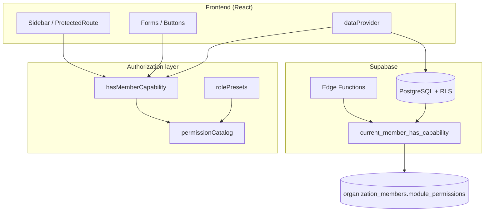

# Nomi CRM — Diseño RBAC objetivo

> **Basado en:** `SYSTEM_AUDIT.md` (auditoría 2026-05-22)  
> **Estado:** Propuesta de diseño — **no implementado**  
> **Producto:** LBS (default) + Contractor mode

---

## 1. Objetivos

| Objetivo | Descripción |
|---|---|
| **Un solo modelo** | Una fuente de verdad para UI, mutaciones frontend y RLS Postgres |
| **Granularidad real** | No solo “ver CRM”, sino acciones: leer, crear, editar, borrar, enviar, aprobar, ver montos |
| **Compatibilidad** | Migración gradual desde `roles[]` + `module_permissions` JSON actuales |
| **Multi-tenant** | Permisos scoped por `org_id`; admin org ≠ platform operator |
| **Auditable** | Quién cambió permisos y cuándo (fase posterior) |

---

## 2. Principios de diseño (para este stack)

1. **Postgres RLS es la ley** — La UI puede ocultar botones, pero si RLS permite INSERT, el usuario puede abusar vía API.
2. **Capabilities, no solo roles** — Los roles son **plantillas** (presets); lo que se guarda por usuario son **capabilities** booleanas.
3. **Convención de IDs:** `{area}.{acción}` o `{area}.{recurso}.{acción}`  
   Ejemplos ya en código: `messaging.send`, `crm.upload_images`.
4. **Acciones estándar:**

   | Acción | Significado |
   |---|---|
   | `view` | list + show (lectura) |
   | `create` | insert |
   | `edit` | update |
   | `delete` | delete |
   | `send` | enviar mensaje/SMS/propuesta |
   | `approve` | aprobar time entry, pago, etc. |
   | `manage` | create + edit + delete en recurso admin (settings, forms schema) |

5. **Capa transversal:** `view_amounts.show` — enmascara campos 💰 en UI; RLS no oculta columnas (usar views o column-level via app).

---

## 3. Modelo de datos propuesto

### Opción recomendada: **Evolución del JSON actual (Fase 1–2)**

Mantener `organization_members.module_permissions` como store principal, con schema estable:

```typescript
type MemberPermissions = {
  // Flags de módulo (derivados automáticamente de hijos)
  crm?: boolean;
  messaging?: boolean;
  // ... resto MEMBER_MODULE_KEYS

  // Capabilities granulares (fuente de verdad)
  "crm.contacts.view"?: boolean;
  "crm.contacts.edit"?: boolean;
  "messaging.send"?: boolean;
  // ...
};
```

**Ventajas:** ya existe UI (árbol Settings → Users), edge function `users`, helpers en `memberModuleAccess.ts`.  
**Desventaja:** difícil auditar/historial; queries SQL menos ergonómicas.

### Opción Fase 3 (normalizada) — cuando necesites roles custom por org

```sql
-- Catálogo global (seed en migración, no editable por tenant)
create table public.permission_capabilities (
  id text primary key,           -- 'messaging.send'
  module_key text not null,      -- 'messaging'
  label text not null,
  description text,
  product_modes text[] default '{lbs,contractor}',
  sort_order int default 0
);

-- Plantillas de rol por org (opcional: roles predefinidos + custom)
create table public.organization_roles (
  id bigint generated always as identity primary key,
  org_id bigint not null references organizations(id),
  slug text not null,            -- 'sales_rep', 'project_manager'
  name text not null,
  is_system boolean default false, -- plantillas built-in no borrables
  unique (org_id, slug)
);

create table public.organization_role_capabilities (
  role_id bigint references organization_roles(id) on delete cascade,
  capability_id text references permission_capabilities(id),
  primary key (role_id, capability_id)
);

-- Asignación usuario → roles (N:N) O override directo
create table public.organization_member_capabilities (
  member_id bigint references organization_members(id) on delete cascade,
  capability_id text references permission_capabilities(id),
  granted boolean not null default true,
  primary key (member_id, capability_id)
);

create table public.organization_member_roles (
  member_id bigint references organization_members(id) on delete cascade,
  role_id bigint references organization_roles(id) on delete cascade,
  primary key (member_id, role_id)
);
```

**Resolución efectiva:**  
`effective_capability = administrator OR member_capabilities.granted OR ANY(role_capabilities)`.

**Deprecar:** `organization_members.roles[]` → derivado read-only para RLS legacy durante transición.

---

## 4. Catálogo completo de capabilities

### Leyenda producto
- **LBS** = `VITE_PRODUCT_MODE=lbs`
- **CTR** = contractor mode

### 4.1 CRM / Leads / Clients / Projects

| Capability ID | UI / Recurso | Acciones | Modo |
|---|---|---|---|
| `crm.contacts.view` | Leads, Contacts list/show | GET | LBS+CTR |
| `crm.contacts.create` | Crear lead/contacto | POST | LBS+CTR |
| `crm.contacts.edit` | Editar contacto | PATCH | LBS+CTR |
| `crm.contacts.delete` | Borrar contacto | DELETE | LBS+CTR |
| `crm.companies.view` | Clients, Companies | GET | LBS+CTR |
| `crm.companies.create` | Crear client/company | POST | LBS+CTR |
| `crm.companies.edit` | Editar | PATCH | LBS+CTR |
| `crm.companies.delete` | Borrar | DELETE | LBS+CTR |
| `crm.pipeline.view` | Projects/deals board | GET | LBS+CTR |
| `crm.pipeline.create` | Nuevo project | POST | LBS+CTR |
| `crm.pipeline.edit` | Mover stage, edit deal | PATCH | LBS+CTR |
| `crm.pipeline.delete` | Archivar/borrar deal | DELETE | LBS+CTR |
| `crm.tasks.view` | Tasks list | GET | LBS+CTR |
| `crm.tasks.create` | Crear task | POST | LBS+CTR |
| `crm.tasks.edit` | Editar/completar | PATCH | LBS+CTR |
| `crm.tasks.delete` | Borrar task | DELETE | LBS+CTR |
| `crm.notes.view` | Notes | GET | LBS+CTR |
| `crm.notes.create` | Crear note | POST | LBS+CTR |
| `crm.notes.edit` | Editar note | PATCH | LBS+CTR |
| `crm.notes.delete` | Borrar note | DELETE | LBS+CTR |
| `crm.upload_images` | Storage attachments | INSERT storage | LBS+CTR |
| `calendar.view` | Calendar page | GET calendar_events | LBS |
| `calendar.manage` | CRUD eventos | POST/PATCH/DELETE | LBS |
| `meetings.view` | Meetings page | GET calendar_events | LBS |

> **Mapeo desde árbol actual:** expandir `crm.contacts`, `crm.pipeline`, `crm.tasks`, `crm.notes` en sub-capabilities view/create/edit/delete.

### 4.2 Messaging

| Capability ID | Recurso | Enforcement |
|---|---|---|
| `messaging.conversations.view` | conversations, participants, messages | RLS SELECT |
| `messaging.send` | conversation_messages INSERT, send_client_sms | RLS WITH CHECK ✅ (parcial) |
| `messaging.settings.manage` | organization_messaging_settings, edge messaging_settings | Admin + JWT |

### 4.3 Proposals & Contracts (LBS)

| Capability ID | Recurso |
|---|---|
| `proposals.view` | proposals, proposal_line_items |
| `proposals.create` | POST proposals |
| `proposals.edit` | PATCH proposals |
| `proposals.send` | Enviar al cliente (future) |
| `proposals.delete` | DELETE |
| `contracts.view` | contracts |
| `contracts.create` | POST |
| `contracts.edit` | PATCH |
| `contracts.delete` | DELETE |

### 4.4 Forms & Support (LBS)

| Capability ID | Recurso |
|---|---|
| `forms.manage` | forms CRUD |
| `forms.submissions.view` | form_submissions |
| `support.tickets.view` | tickets |
| `support.tickets.manage` | tickets CRUD |
| `support.messages.send` | ticket_messages INSERT |

### 4.5 Deal operations & financials

| Capability ID | Tablas |
|---|---|
| `deal_operations.resources.view` | deal_resources |
| `deal_operations.resources.manage` | CRUD |
| `deal_operations.subcontractors.view` | deal_subcontractor_entries |
| `deal_operations.subcontractors.manage` | CRUD |
| `deal_operations.credentials.view` | deal_access_entries (sin password) |
| `deal_operations.credentials.manage` | deal_access_entries incl. password |
| `deal_financials.expenses.view` | deal_expenses |
| `deal_financials.expenses.manage` | CRUD |
| `deal_financials.change_orders.view` | deal_change_orders |
| `deal_financials.change_orders.manage` | CRUD |
| `deal_financials.collections.view` | deal_client_payments |
| `deal_financials.collections.manage` | CRUD |
| `deal_financials.commissions.view` | deal_commissions |
| `deal_financials.commissions.manage` | CRUD |

### 4.6 People / Time / Payroll (Contractor)

| Capability ID | Alineado con crmPermissions.ts |
|---|---|
| `people.view` | people GET |
| `people.manage` | people CRUD |
| `people.adjustments.manage` | employee_pto_adjustments |
| `time.entries.view` | time_entries GET |
| `time.entries.manage` | time_entries CRUD |
| `time.entries.approve` | status → approved |
| `payroll.view` | payments, payroll_runs GET |
| `payroll.manage` | payments, payroll_runs CRUD |
| `payroll.approve` | status → approved |
| `payroll.pay` | status → paid |
| `payroll.loans.manage` | employee_loans, deductions |

### 4.7 Admin & cross-cutting

| Capability ID | Alcance |
|---|---|
| `admin.users.manage` | organization_members, edge users |
| `admin.settings.manage` | configuration, billing, messaging settings |
| `reports.view` | report_* views, ReportsPage |
| `view_amounts.show` | UI mask 💰 (ya existe) |

### 4.8 Platform (fuera tenant CRM)

| Capability | Tabla |
|---|---|
| `platform.operator` | platform_operators — consola `/sas` |

---

## 5. Plantillas de rol (presets)

Roles **no son mutuamente excluyentes** en el diseño objetivo (un usuario puede tener varios).  
En la UI simplificada puedes mostrar un rol primario + overrides.

### 5.1 Matriz rol → capabilities (LBS)

| Capability | Admin org | Project Mgr | Sales Rep | Designer | Support | Finance | Read-only |
|---|:---:|:---:|:---:|:---:|:---:|:---:|:---:|
| **CRM** |
| crm.contacts.* | ✅ | ✅ | ✅ | ◐ view | ◐ view | ◐ view | ◐ view |
| crm.companies.* | ✅ | ✅ | ✅ | ◐ view | ◐ view | ◐ view | ◐ view |
| crm.pipeline.* | ✅ | ✅ | ◐ view/edit | ◐ view | ◐ view | ◐ view | ◐ view |
| crm.tasks.* | ✅ | ✅ | ✅ | ✅ | ◐ view | ◐ view | ◐ view |
| crm.notes.* | ✅ | ✅ | ✅ | ✅ | ✅ | ◐ view | ◐ view |
| crm.upload_images | ✅ | ✅ | ✅ | ✅ | ❌ | ❌ | ❌ |
| **Calendar / Meetings** |
| calendar.* | ✅ | ✅ | ◐ view | ◐ view | ❌ | ❌ | ◐ view |
| **Messaging** |
| messaging.conversations.view | ✅ | ✅ | ✅ | ✅ | ✅ | ◐ view | ◐ view |
| messaging.send | ✅ | ✅ | ✅ | ✅ | ✅ | ❌ | ❌ |
| **Proposals / Contracts** |
| proposals.* | ✅ | ✅ | ✅ manage | ❌ | ❌ | ◐ view | ◐ view |
| contracts.* | ✅ | ✅ | ◐ view | ❌ | ❌ | ◐ view | ◐ view |
| **Forms** |
| forms.manage | ✅ | ✅ | ❌ | ❌ | ❌ | ❌ | ❌ |
| forms.submissions.view | ✅ | ✅ | ✅ | ❌ | ✅ | ✅ | ◐ view |
| **Support** |
| support.tickets.* | ✅ | ✅ | ◐ view | ❌ | ✅ manage | ❌ | ◐ view |
| **Deal ops / financials** |
| deal_operations.* | ✅ | ✅ manage | ❌ | ❌ | ❌ | ❌ | ❌ |
| deal_financials.* | ✅ | ◐ view | ❌ | ❌ | ❌ | ✅ manage | ❌ |
| **Admin** |
| admin.users.manage | ✅ | ❌ | ❌ | ❌ | ❌ | ❌ | ❌ |
| admin.settings.manage | ✅ | ❌ | ❌ | ❌ | ❌ | ❌ | ❌ |
| view_amounts.show | ✅ | ✅ | ✅ | ❌ | ❌ | ✅ | ❌ |

**Leyenda:** ✅ full (view+create+edit+delete) · ◐ parcial (solo celdas indicadas) · ❌ ninguno

### 5.2 Mapeo roles legacy → plantillas

| `roles[]` actual | Plantilla objetivo |
|---|---|
| `admin` | Admin org (`administrator=true`) |
| `sales_manager` | Project Manager |
| `employee` | Sales Rep |
| `manager` | Project Manager |
| `designer`, `developer`, `marketing` | Designer |
| `hr` | *(contractor)* People manager |
| `accountant`, `payroll_manager` | Finance / Payroll |

---

## 6. Mapeo capability → Postgres RLS

### Función central (evolucionar la existente)

```sql
-- Ya existe (parcial):
public.current_member_has_capability(p_capability text) → boolean

-- Objetivo: usar en TODAS las políticas INSERT/UPDATE/DELETE
-- Ejemplo conversation_messages (ya implementado):
with check (
  author_member_id = current_user_member_id()
  and current_member_has_capability('messaging.send')
);
```

### Patrón por tabla

| Tabla | SELECT | INSERT | UPDATE | DELETE |
|---|---|---|---|---|
| contacts | `crm.contacts.view` | `crm.contacts.create` | `crm.contacts.edit` | `crm.contacts.delete` |
| companies | `crm.companies.view` | … | … | … |
| deals | `crm.pipeline.view` | … | … | … |
| conversation_messages | `messaging.conversations.view` | `messaging.send` | ❌ o own | ❌ |
| deal_expenses | `deal_financials.expenses.view` | `deal_financials.expenses.manage` | same | same |
| payments | `payroll.view` | `payroll.manage` | `payroll.approve`/`payroll.pay` | `payroll.manage` |

**Org scope (siempre):** `org_id = current_user_org_id()`.

**Admin bypass:** `organization_members.administrator = true` → `current_member_has_capability` retorna true.

---

## 7. Mapeo capability → Frontend

```
┌─────────────────┐     ┌──────────────────────┐     ┌─────────────────┐
│ Sidebar nav     │────▶│ canAccess(resource,  │────▶│ hasCapability   │
│ ProtectedRoute  │     │ action)              │     │ (resource.action)│
└─────────────────┘     └──────────────────────┘     └─────────────────┘
         │                        │                          │
         ▼                        ▼                          ▼
┌─────────────────┐     ┌──────────────────────┐     ┌─────────────────┐
│ Hide menu item  │     │ dataProvider guard   │     │ Disable button  │
│ Redirect /      │     │ canMutateCrmResource │     │ Show message    │
└─────────────────┘     └──────────────────────┘     └─────────────────┘
```

### Refactor `canAccess(resource, action)`

Reemplazar lógica dual (roles legacy vs modules) por:

```typescript
function canAccess(identity, { resource, action }) {
  if (identity.administrator) return true;
  const cap = RESOURCE_ACTION_TO_CAPABILITY[resource]?.[action];
  if (!cap) return true; // default open until catalogued
  return hasMemberCapability(identity, cap);
}
```

Tabla `RESOURCE_ACTION_TO_CAPABILITY` vive junto a `workspacePermissionTree.ts`.

### Sidebar LBS (`navigation.ts`)

Cada item debe declarar **capability** explícita (no solo resource genérico):

```typescript
{ to: "/messages", label: "Messages", capability: "messaging.conversations.view" }
{ to: "/leads", label: "Leads", capability: "crm.contacts.view" }
```

---

## 8. Edge Functions — matriz auth

| Function | Capability requerida |
|---|---|
| users | `admin.users.manage` |
| messaging_settings | `admin.settings.manage` o `messaging.settings.manage` |
| send_client_sms | `messaging.send` ✅ |
| stripe-billing | `admin.settings.manage` |
| merge_contacts | `crm.contacts.edit` |
| submit_public_form | **público** (sin auth) |
| twilio_inbound_sms | webhook signature |

---

## 9. Plan de implementación por fases

### Fase 0 — Documentación y catálogo (1 semana)
- [ ] Congelar lista capability IDs en `permissionCatalog.ts` (shared TS)
- [ ] Matriz rol preset en código (seed defaults al invitar usuario)
- [ ] Tests unitarios `hasMemberCapability` / expand / collapse

### Fase 1 — Completar UI + persistencia (2 semanas)
- [ ] Expandir árbol Settings con view/create/edit/delete por área
- [ ] Presets: “Sales Rep”, “Project Manager”, … (aplicar bundle de capabilities)
- [ ] Asegurar edge `users` persiste todas las keys (✅ corregido recientemente)
- [ ] `authProvider.canAccess` siempre pasa `module_permissions`

### Fase 2 — Enforcement frontend (2 semanas)
- [ ] `RESOURCE_ACTION_TO_CAPABILITY` + refactor `canAccess`
- [ ] `canMutateCrmResource` delega a capabilities (reemplazar crmPermissions duplicado)
- [ ] Botones deshabilitados + mensajes (patrón messaging.send)
- [ ] `view_amounts.show` audit en todos los widgets 💰

### Fase 3 — RLS Postgres (3–4 semanas, incremental por módulo)
- [ ] Migración: ampliar `current_member_has_capability` (ya existe)
- [ ] Module-by-module: contacts → companies → deals → tasks → proposals → …
- [ ] Mantener `roles[]` sync como fallback 90 días
- [ ] Tests SQL: `SET request.jwt.claims` + assert policies

### Fase 4 — Roles normalizados + audit (opcional)
- [ ] Tablas `organization_roles`, `organization_member_roles`
- [ ] UI “Roles” tab en Settings (crear rol custom por org)
- [ ] `permission_audit_log` (member_id, changed_by, diff jsonb, at)

---

## 10. Diagrama de arquitectura objetivo



---

## 11. Decisiones abiertas (para validar contigo)

| # | Pregunta | Opción A | Opción B |
|---|---|---|---|
| 1 | ¿Roles múltiples por usuario? | Sí (N:N) | Un solo rol + overrides |
| 2 | ¿Permisos a nivel registro (solo mis deals)? | Fase 5 (owner-based RLS) | Solo org-wide por ahora |
| 3 | ¿Client user portal? | NO EXISTE hoy | Futuro schema separado |
| 4 | ¿Contractor mode en mismo RBAC catalog? | Un catálogo, filtrado por product_mode | Catálogos separados |
| 5 | ¿Quién edita roles? | Solo admin org | Admin + Project Manager delegado |

**Recomendación:** B, org-wide primero, un catálogo filtrado por modo, solo admin org edita permisos.

---

## 12. Resumen

El camino más corto para RBAC production-grade en Nomi **no es reescribir desde cero**, sino:

1. **Formalizar el catálogo de ~60–80 capabilities** (view/create/edit/delete por área).
2. **Usar `module_permissions` JSON** como store (Fase 1–3) con `current_member_has_capability()` en RLS.
3. **Plantillas de rol** para onboarding rápido (matriz sección 5).
4. **Normalizar tablas de roles** solo cuando clientes pidan roles custom nombrados.

Con esto el árbol de Settings que ya construiste se convierte en la **UI del RBAC**, y Postgres deja de depender solo de `roles[]` legacy.

---

*Documento complementario a `SYSTEM_AUDIT.md`. Siguiente paso sugerido: implementar Fase 0 (`permissionCatalog.ts` + presets) si apruebas el catálogo de capabilities.*
