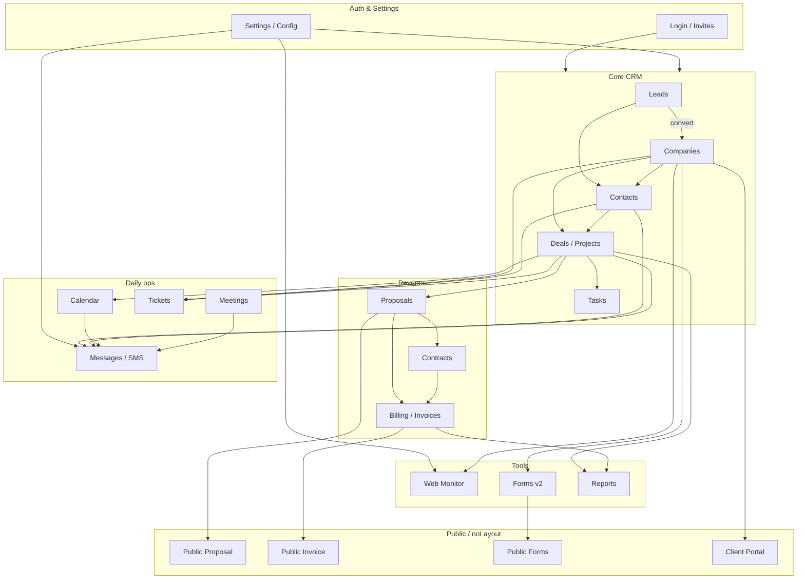
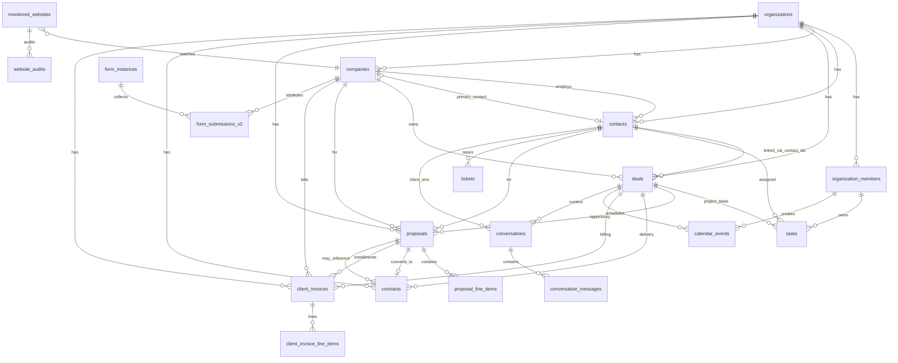
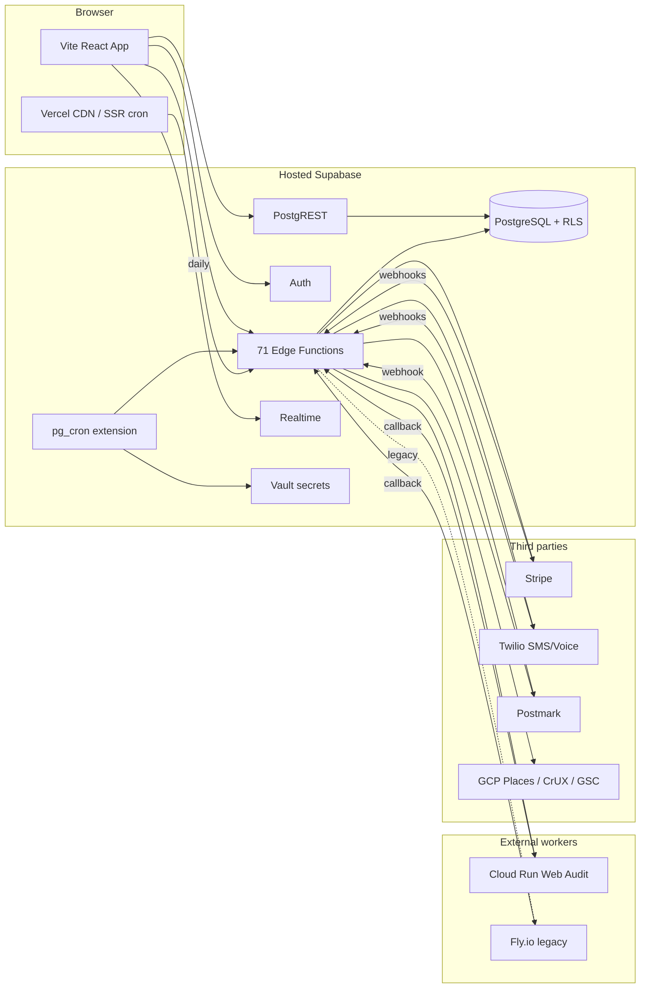

# Nomi CRM — Audit Overview

**Date:** 2026-06-02  
**Scope:** Full READ-ONLY audit (batches 1–2 + final wrap-up). One code fix applied during audit close-out: `TicketsList` Badge import.  
**Status:** Audit complete. Fixes execute in a separate **fix phase** with explicit approval.

---

## Executive summary

Nomi CRM is a **React 19 + Supabase + Vercel** agency CRM with ~80 routes, 71 edge functions, and a dual-layer frontend: generic **atomic-crm** (~15k LOC) plus **LBS product** modules (proposals, billing, web monitor, forms v2, etc.).

### Overall health

| Area | Assessment |
|------|------------|
| **Core CRM** (contacts, companies, deals, tasks) | Mostly **WORKING**; a few **HIGH** data-layer and filter issues |
| **Revenue stack** (proposals, contracts, billing) | **PARTIAL** — missing-import crashes in batch 1 (fixes in working tree, not all committed) |
| **Daily work** (calendar, messages, tickets) | **WORKING** / **PARTIAL** — tickets Badge fixed; calendar cron unwired |
| **Tools** (web monitor, forms, reports) | **WORKING** — reports hidden from nav by design (pending sidebar link) |
| **Infrastructure** | Solid Supabase + pg_cron + Vercel crons; 2 orphaned schedulers; 1 repo/live pg_cron drift |
| **Mobile** | **PARTIAL** — only contacts, companies, tasks list; no LBS custom routes |

### Critical findings (fix phase)

1. **Missing imports** (runtime crashes): `ContractsList`, `ProposalsList`, `ConvertLeadButton` — documented batch 1; fixes in working tree.
2. **PostgREST filters:** `stage@nin` caused 400s — fixed to `@in` allow-list; **Option A confirmed** — never use `@nin` (see `20-data-provider.md`).
3. **`getOne` with empty id → 406** on proposals/contacts — extend `isValidRecordId` guards (queued).
4. **Orphaned schedulers:** `process_missed_invoice_payment_receipts` needs daily pg_cron; `send_calendar_reminders` stays **DORMANT**.
5. **Dead routes/components:** placeholders, ImportPage, ContactQuickViewPage, StandaloneInvoiceShowPage — **DELETE queued** (see `19-orphaned-routes.md`).

### Approved product decisions

- **`/reports`:** KEEP — add Tools sidebar link in fix phase.
- **Data layer:** Option A only — positive `@in` allow-lists; no library patching.
- **WhatsApp/voice edge stubs:** DORMANT — pending Meta appeal; not deletion candidates.
- **SignupPage:** KEEP code; route stays disabled.

---

## Module status (all audited modules)

| Module | File | Status | Critical | High |
|--------|------|--------|----------|------|
| Dashboard | `02-dashboard.md` | WORKING | 0 | 0 |
| Leads | `03-leads.md` | PARTIAL | 1 | 1 |
| Companies | `04-companies-clients.md` | PARTIAL | 0 | 1 |
| Contacts | `05-contacts.md` | PARTIAL | 0 | 1 |
| Deals | `06-deals-pipeline.md` | PARTIAL | 0 | 1 |
| Proposals | `07-proposals.md` | PARTIAL | 1 | 1 |
| Contracts | `08-contracts.md` | PARTIAL | 1 | 0 |
| Billing | `09-billing.md` | PARTIAL | 0 | 0 |
| Tasks | `10-tasks.md` | WORKING | 0 | 0 |
| Calendar + Meetings | `11-calendar-meetings.md` | WORKING | 0 | 1 |
| Messages | `12-messages.md` | PARTIAL | 0 | 0 |
| Tickets | `13-tickets.md` | WORKING | 0 | 0 |
| Web Monitor | `14-web-monitor.md` | WORKING | 0 | 0 |
| Forms v2 | `15-forms-v2.md` | WORKING | 0 | 0 |
| Reports | `16-reports.md` | PARTIAL | 0 | 0 |
| Settings + Profile | `17-settings-profile.md` | WORKING | 0 | 0 |
| Auth | `22-auth-session-invites.md` | WORKING | 0 | 0 |
| Data layer | `20-data-provider.md` | PARTIAL | 0 | 2 |
| Orphaned routes | `19-orphaned-routes.md` | — | — | — |

**Tooling:** `tsc --noEmit` ✅; `npm run lint` ❌ 1 error in unrelated script (`generate-proposal-stress-pdf.ts`).

---

## Diagram 1 — Module dependency map

High-level data and navigation flow between major product areas (arrows = primary reads/writes or user navigation).

---

## Diagram 2 — Core database ER (main tables)

Simplified org-scoped model. All tenant tables include `org_id` where applicable (omitted on some legacy columns for brevity).

**Summary views (read paths):** `companies_summary`, `contacts_summary`, `monitored_websites_summary` — used by dataProvider instead of base tables for list/getOne.

---

## Diagram 3 — Infrastructure map

**Live pg_cron (6 jobs):** `website_monitor_run`, `website_audit_schedule` (×2), `fail_stale_website_audits`, `process_invoice_payment_reminders`, `process_invoice_auto_charges`.  
**Vercel cron (2):** `process_scheduled_payments`, `process_scheduled_client_invoices`.

---

## Prioritized fix plan

Execute in order. **Do not delete code until fix phase PR is approved.**

### P0 — Runtime crashes (same day)

| # | Fix | Files | Status |
|---|-----|-------|--------|
| 1 | Import `Badge` in TicketsList | `TicketsList.tsx` | ✅ Done (`fix: TicketsList missing Badge import`) |
| 2 | Import `Badge` in ContractsList | `ContractsList.tsx` | Queued |
| 3 | Import `MoneyText` in ProposalsList | `ProposalsList.tsx` | Queued |
| 4 | Import `Button` in ConvertLeadButton | `ConvertLeadButton.tsx` | Queued |

### P1 — Data integrity & filters (week 1)

| # | Fix | Reference |
|---|-----|-----------|
| 5 | Confirm `openDealFilters` uses `@in` only (Option A) | `20-data-provider.md` |
| 6 | Extend `isValidRecordId` to proposals/deals/contracts Show hooks | `20-data-provider.md` |
| 7 | Remove manual `%` in `BillToClientSearch`, `submissionFilterUtils` | `20-data-provider.md` |

### P2 — Ops & schedulers (week 1–2)

| # | Fix | Reference |
|---|-----|-----------|
| 8 | Add daily pg_cron for `process_missed_invoice_payment_receipts` | `09-billing.md`, mirror `invoke_client_invoice_billing_cron` |
| 9 | Deploy `fail_stale_website_audits_5m` migration to live DB | `14-web-monitor.md` |
| 10 | Verify `WEB_AUDIT_WORKER_URL` → Cloud Run; decommission Fly if idle | `14-web-monitor.md`, `CLOUD_RUN.md` |
| 11 | Keep `send_calendar_reminders` **DORMANT** — document only | `11-calendar-meetings.md` |

### P3 — Navigation & cleanup (week 2)

| # | Fix | Reference |
|---|-----|-----------|
| 12 | Add `/reports` under Tools in sidebar | `19-orphaned-routes.md` |
| 13 | DELETE placeholder routes (proposals/contracts/tickets) | `19-orphaned-routes.md` |
| 14 | DELETE ImportPage + `/import` redirect | `19-orphaned-routes.md` |
| 15 | DELETE ContactQuickViewPage, StandaloneInvoiceShowPage | `19-orphaned-routes.md` |

### P4 — UX & permissions (week 2–3)

| # | Fix | Reference |
|---|-----|-----------|
| 16 | Calendar/meetings route guards → `calendar.view` / `meetings.view` | `11-calendar-meetings.md` |
| 17 | Spanish UI strings → English (web monitor settings, auth errors) | `17-settings-profile.md`, `22-auth-session-invites.md` |
| 18 | Reports permission alignment (`reports.view` vs page role check) | `16-reports.md` |
| 19 | Mobile: evaluate mounting LBS custom routes | `00-INVENTORY.md` |

### P5 — Restructure (optional, post-stabilization)

See `RESTRUCTURE-PROPOSAL.md` — folder consolidation, god-file splits, naming alignment.

---

## Live pg_cron jobs (hosted database)

Queried via `npx supabase db query --linked` on project `qjglkywmqwqdoaboakao`:

| jobname | schedule | Edge function |
|---------|----------|---------------|
| `client_invoice_auto_charges_daily` | `0 15 * * *` | `process_invoice_auto_charges` |
| `client_invoice_payment_reminders_daily` | `0 14 * * *` | `process_invoice_payment_reminders` |
| `fail_stale_website_audits` | `*/15 * * * *` | SQL only |
| `website_audit_push_retry` | `*/5 * * * *` | `website_audit_schedule` (retry) |
| `website_audit_schedule_daily` | `0 7 * * *` | `website_audit_schedule` (due) |
| `website_monitor_run_every_5m` | `*/5 * * * *` | `website_monitor_run` |

**Vercel cron:** `process_scheduled_payments`, `process_scheduled_client_invoices`.

**Fix phase queue:** `process_missed_invoice_payment_receipts` (daily pg_cron); `fail_stale_website_audits_5m` (migration deploy).

**DORMANT (do not wire):** `send_calendar_reminders`.

---

## ORPHANED / DORMANT edge functions

### Orphaned schedulers

| Function | Decision |
|----------|----------|
| `process_missed_invoice_payment_receipts` | **Plan daily pg_cron** in fix phase (payment receipts) |
| `send_calendar_reminders` | **DORMANT** — documented; do not wire until product decision |

### DORMANT — pending Meta appeal (NOT deletion candidates)

`send_whatsapp`, `whatsapp_inbound`, `voice_token`, `voice_status_webhook`

---

## Edge function → module map (all 71)

| Edge function | Module(s) | Invoked from |
|---------------|-----------|--------------|
| `accept_proposal` | Proposals | `dataProvider`, `publicProposalApi.ts` |
| `access_entry_password` | Deals | `dataProvider` |
| `charge_client_invoice_on_file` | Billing | `dataProvider` |
| `client_portal` | Portal | `ClientPortalPage.tsx` |
| `client_portal_credentials` | Portal / Settings | `portalCredentialsApi.ts` |
| `create_client_invoice` | Billing | `dataProvider` |
| `deal_secret_value` | Deals | `dataProvider` |
| `deliver_project` | Deals | `dataProvider` |
| `email_settings` | Settings / Messages | `dataProvider` |
| `forms_embed_js` | Forms v2 | External script URL |
| `generate_form_token` | Forms v2 / Deals | `dataProvider` |
| `get_form_by_token` | Forms v2 | `dataProvider` |
| `get_github_repo_status` | Deals | `dataProvider` |
| `get_public_deal_brief` | Deals | `dataProvider` |
| `get_public_invoice` | Billing | `publicInvoiceApi.ts` |
| `get_public_proposal` | Proposals | `publicProposalApi.ts` |
| `google_gsc/*` | Web Monitor / Settings | `dataProvider` |
| `google_places` | Companies / Leads / Contacts | `edgeProxy.ts` |
| `issue_client_invoice` | Proposals, Billing | `dataProvider` |
| `manage_client_invoice` | Billing | `dataProvider` |
| `merge_contacts` | Contacts | `dataProvider` |
| `messaging_settings` | Settings / Messages | `dataProvider` |
| `notify_follow_up` | Calendar | `dataProvider` |
| `pay_client_invoice` | Billing | `publicInvoiceApi.ts` |
| `pay_proposal_deposit` | Proposals | `publicProposalApi.ts` |
| `platform-directory` | Settings | `dataProvider` |
| `postmark` | Email | Webhook |
| `prepare_client_invoice_payment` | Billing | `publicInvoiceApi.ts` |
| `process_invoice_auto_charges` | Billing | pg_cron |
| `process_invoice_payment_reminders` | Billing | pg_cron |
| `process_scheduled_client_invoices` | Billing | Vercel cron |
| `process_scheduled_payments` | Billing | Vercel cron |
| `record_form_event` | Forms v2 | `dataProvider` |
| `resend_client_invoice_payment_receipt` | Billing | `dataProvider` |
| `resolve_portal_short_code` | Portal | `PortalShortUrlRedirect.tsx` |
| `resolve_short_code` | Forms v2 | `ShortUrlRedirect.tsx` |
| `schedule_client_invoice` | Billing | `dataProvider` |
| `send_client_invoice` | Billing | `dataProvider` |
| `send_client_invoice_payment_link` | Billing | `dataProvider` |
| `send_client_sms` | Messages | `dataProvider` |
| `send_meeting_link` | Meetings | `dataProvider` |
| `send_proposal` | Proposals | `dataProvider` |
| `share_client_invoice` | Billing | `dataProvider` |
| `sign_proposal_contract` | Proposals | `publicProposalApi.ts` |
| `stripe-billing` | Settings | `dataProvider` |
| `stripe-client-webhook` | Billing | Webhook |
| `stripe-webhook` | Settings | Webhook |
| `submit_form_v2` | Forms v2 | `dataProvider` |
| `submit_project_resources` | Deals | `dataProvider` |
| `twilio_inbound_sms` | Messages | Webhook |
| `update_client_invoice` | Billing | `dataProvider` |
| `update_password` | Auth | `dataProvider` |
| `upload_form_file` | Forms v2 | `uploadFormFile.ts` |
| `users` | Settings / Auth | `dataProvider` |
| `website_audit_callback` | Web Monitor | Webhook (worker) |
| `website_audit_enqueue` | Web Monitor | `dataProvider` |
| `website_audit_schedule` | Web Monitor | pg_cron |
| `website_audit_send` | Web Monitor | `dataProvider` |
| `website_audit_summarize` | Web Monitor | `dataProvider` |
| `website_monitor_check` | Web Monitor | `dataProvider` |
| `website_monitor_create` | Web Monitor | `dataProvider` |
| `website_monitor_run` | Web Monitor | pg_cron |
| `website_monitor_run_org` | Web Monitor | `dataProvider` |
| `website_monitor_sync` | Web Monitor | `dataProvider` |
| `zoho_oneshot_import` | Settings | `DataImportSection.tsx` |

Plus DORMANT: `send_whatsapp`, `whatsapp_inbound`, `voice_token`, `voice_status_webhook`, `send_calendar_reminders`, `process_missed_invoice_payment_receipts` (pending cron).

---

## Audit document index

| File | Purpose |
|------|---------|
| `00-INVENTORY.md` | Route & backend inventory (STEP 0) |
| `00-OVERVIEW.md` | This file — executive summary, diagrams, fix plan |
| `02-dashboard.md` … `22-auth-session-invites.md` | Module audits |
| `19-orphaned-routes.md` | Orphan route decisions |
| `20-data-provider.md` | Data layer deep dive + Option A |
| `RESTRUCTURE-PROPOSAL.md` | Folder restructure (STEP 3) |
| `AGENT-RULES.md` | Agent conventions (STEP 4) |

**Audit complete.** Proceed to fix phase per prioritized plan above.
